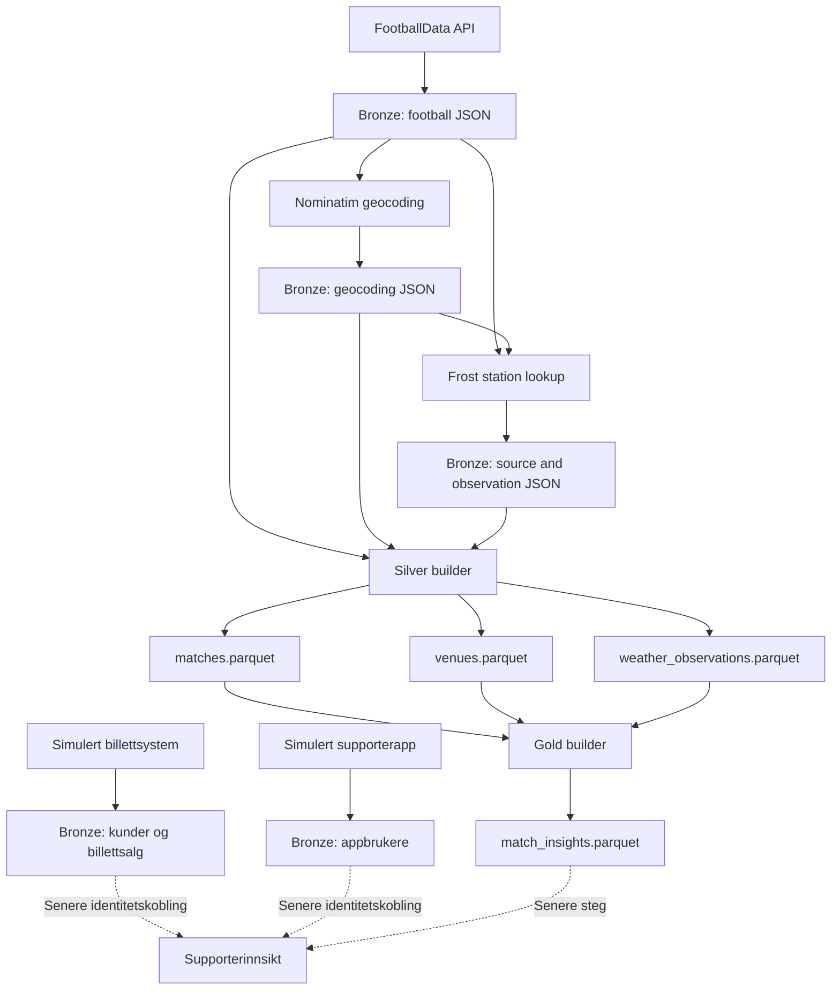

# Football Club Data Platform


Et lite portfolio-prosjekt som viser hvordan en dataplattform for en fotballklubb
kan bygges stegvis med en **Bronze → Silver → Gold**-arkitektur.

> [!IMPORTANT]
> Dette er en teknisk demonstrasjon og et læringsprosjekt. Det er ikke en
> produksjonsklar plattform, og skal ikke presenteres som en komplett løsning for
> drift, analyse eller beslutningsstøtte i en faktisk fotballklubb.

Prosjektet bruker FK Bodø/Glimt som eksempel og kombinerer kampdata,
stadioninformasjon og historiske værobservasjoner. Det inneholder også en
helsyntetisk supporterpopulasjon fra to simulerte kildesystemer. Hensikten er å
demonstrere grunnleggende prinsipper som rådataingest, lagdeling,
kildeuavhengige modeller, datakvalitet, deterministiske nøkler og
reproduserbare datasett.

## Hva prosjektet demonstrerer

- Innhenting fra flere eksterne API-er med forskjellig autentisering.
- Uendrede kilderesponser i et Bronze-lag.
- Filbasert caching for å unngå unødvendige API-kall.
- Normalisering til typede Parquet-datasett i Silver.
- Deduplisering av kamper og sammenslåing av venue-aliaser.
- Kobling fra stadion til nærmeste relevante værstasjon.
- Et analyseklart Gold-dataprodukt bygget utelukkende fra Silver.
- Deterministisk generering av fragmenterte, syntetiske supporterdata i Bronze.
- Enkel, eksplisitt datakvalitetsvalidering uten eget rammeverk.
- Tester av både normalflyt, feiltilfeller og deterministisk output.

Prosjektet demonstrerer foreløpig **ikke** orkestrering, skalerbar distribuert
prosessering, produksjonsovervåkning eller en bred portefølje av
forretningsmodeller.

## Arkitektur



### Bronze

Bronze representerer kildesystemene. HTTP-responsene lagres som mottatt, uten
flattening eller forretningslogikk:

```text
data/bronze/
├── football/
├── geocoding/
├── weather/
		├── sources/
		└── observations/
└── supporter/
		├── ticket_system/
		└── app/
```

Dette gjør det mulig å inspisere originaldata, bygge Silver på nytt og endre
intern modell uten å hente alle kildene på nytt.

### Silver

Silver representerer plattformens interne, kildeuavhengige modell. Rå JSON blir
typet, validert og skrevet som Parquet:

```text
data/silver/
├── matches.parquet
├── venues.parquet
└── weather_observations.parquet
```

Downstream-kode trenger dermed ikke kjenne JSON-strukturen til FootballData,
Nominatim eller Frost.

### Gold

Gold er det analyseklare laget. Det bygges utelukkende fra Silver og kombinerer
kamp, stadion og vær til ett denormalisert dataprodukt:

```text
data/gold/
└── match_insights.parquet
```

Produktet har én rad per kamp og er ment for direkte bruk i analyse, dashboards
eller enkle modeller, uten at konsumenten trenger å kjenne kildesystemene eller
koble tabellene selv. Andre tenkbare produkter, for eksempel reisebelastning
eller supporterinnsikt, er bevisst holdt utenfor dagens scope.

## Datakilder

| | Kilde | Bruk | Tilgang |
|---|---|---|---|
|  | [FootballData](https://footballdata.io/) | Kamper for team ID `293` | Bearer-token |
|  | [OpenStreetMap Nominatim](https://nominatim.org/) | Geocoding av stadioner | Identifiserende User-Agent |
|  | [MET Norway Frost](https://frost.met.no/) | Værstasjoner og historiske observasjoner | Frost client ID |
| | Syntetisk billettsystem og supporterapp | Fragmenterte supporter- og billettdata | Lokal generator, ingen API-tilgang |

Locationforecast brukes ikke. Det leverer prognoser, mens prosjektet trenger
historiske observasjoner for ferdigspilte kamper.

## Teknologi

- Python 3.9+
- `requests` for HTTP
- `python-dotenv` for lokal konfigurasjon
- `pandas` for tabulære transformasjoner
- `pyarrow` for Parquet
- `unittest` og `unittest.mock` for tester

## Kom i gang

### 1. Opprett miljø

```bash
python3 -m venv .venv
source .venv/bin/activate
python3 -m pip install -r requirements.txt
```

### 2. Konfigurer API-tilgang

```bash
cp .env.example .env
```

Fyll inn følgende i `.env`:

```dotenv
FOOTBALLDATA_API_KEY=your_api_key_here
FROST_CLIENT_ID=your_client_id_here
PLATFORM_USER_AGENT=football-club-data-platform/0.1 your-real-email@example.org
```

- `FOOTBALLDATA_API_KEY` brukes som Bearer-token.
- `FROST_CLIENT_ID` opprettes via
	[Frost credentials](https://frost.met.no/auth/requestCredentials.html).
- `PLATFORM_USER_AGENT` må identifisere applikasjonen med en reell kontaktadresse
	eller nettside for å følge Nominatim-policyen.

`.env` er ignorert av Git. Ikke legg API-nøkler eller personlige credentials i
repoet.

## Kjør pipeline

Kommandoene kjøres fra repo-roten og i denne rekkefølgen:

```bash
python3 -m src.fetch_matches
python3 -m src.geocode_venues
python3 -m src.fetch_weather
python3 -m src.build_silver
python3 -m src.build_gold
python3 -m src.generate_fan_data
```

### 1. Hent kamper

`src/fetch_matches.py` henter kamper for det hardkodede laget `293` og lagrer
hele responsen under:

```text
data/bronze/football/matches_YYYY-MM-DD.json
```

Skriptet bruker 30 sekunders timeout og gir tydelige feil for manglende nøkkel,
autentiseringsfeil, nettverksfeil og andre HTTP-statuser enn 200.

### 2. Geocode stadioner

`src/geocode_venues.py` leser nyeste kampfil, dedupliserer søk og kaller
Nominatim sekvensielt. Det venter minst ett sekund mellom faktiske kall og bruker
eksisterende filer som immutable cache.

```text
data/bronze/geocoding/venue_<slug>_<query-hash>.json
```

Første Nominatim-resultat brukes i denne prototypen. Tomme søkeresultater lagres
og rapporteres, men stopper ikke hele pipelinen.

### 3. Hent historisk vær

`src/fetch_weather.py` bruker venue-koordinatene til å finne nærmeste Frost-
stasjon som tilbyr:

- `air_temperature`
- `sum(precipitation_amount PT1H)`
- `wind_speed`

Stasjonen må være maksimalt 50 km fra stadion. Observasjoner hentes fra tre timer
før til tre timer etter avspark. Source- og observation-responser lagres separat:

```text
data/bronze/weather/sources/
data/bronze/weather/observations/
```

Manglende dekning er et forventet utfall for enkelte europeiske stadioner.

### 4. Bygg Silver

`src/build_silver.py` leser dagens Bronze-filer, bygger canonical entiteter,
validerer dem og skriver tre Parquet-filer. Med datasettet som ligger i repoet per
21. august 2026 blir resultatet:

```text
Matches:              21 rows
Venues:                9 rows, 7 geocoded
Weather observations: 657 rows, 3 elements
```

Tallene er et øyeblikksbilde og vil endres når nye Bronze-data hentes.

### 5. Bygg Gold

`src/build_gold.py` leser de tre Silver-filene, velger været ved kampstart,
validerer resultatet og skriver `data/gold/match_insights.parquet`. Steget gjør
ingen API-kall og leser aldri Bronze direkte. Med datasettet som ligger i repoet
per 21. august 2026 blir resultatet:

```text
Match insights:       21 rows
Med venue-koordinater: 14 rows
Med vær ved avspark:    8 rows
```

### 6. Generer syntetiske supporterdata

`src/generate_fan_data.py` leser kampene fra Silver og genererer to separate,
simulerte kildesystemer direkte i Bronze:

```text
data/bronze/supporter/
├── ticket_system/
│   ├── ticket_customers.csv
│   └── ticket_sales.csv
└── app/
		└── app_users.csv
```

All supporterdata er syntetisk. Navn og kontaktopplysninger tilhører ikke ekte
personer, og e-post bruker bare de reserverte testdomenene `example.com`,
`example.org` og `example.net`.

Generatoren lager 500 underliggende supportere: 425 billettkunder, 375
appbrukere og 300 personer som finnes i begge systemene. Den interne identiteten
brukes bare mens dataene genereres og skrives aldri til råfilene.

- `ticket_customers.csv` har billettsystemets kunde-ID, kontaktfelt og samtykke.
- `ticket_sales.csv` har billettkjøp knyttet direkte til `match_id` i Silver.
- `app_users.csv` har appens separate bruker-ID, profilnavn og appinnstillinger.

For overlappende personer inneholder dataene eksakte e-poster, forskjeller i
store/små bokstaver, ekstra mellomrom, `+alias`, alternative syntetiske adresser
og manglende adresser. Navn varierer mellom fullt navn, fornavn, initialer og
kallenavn. Dette gir både enkle normaliseringsproblemer og tvetydige tilfeller,
uten en ground-truth-fil som avslører koblingen.

Etterspørselen varierer syntetisk med hjemme-/bortekamp, turnering, motstander,
ukedag og tidligere kampresultater. Bare resultater fra tidligere kamper brukes.
Når `gold.match_insights.parquet` finnes, brukes kampværet til å skape moderat
færre sene kjøp ved dårlig vær. Dette er kun en mekanisme for et meningsfullt
demonstrasjonsdatasett, ikke produksjonslineage fra Gold til Bronze.

Identitetsoppløsning, supporter-Silver og et analyseklart supporterprodukt i
Gold kommer i et senere steg og er ikke implementert her.

## Silver-datasett

### `matches.parquet`

Én rad per logical fixture med blant annet kamp-ID, UTC-avspark, turnering,
sesong, lag, score, status, `venue_id` og rå venue-felter.

Dupliserte source-records identifiseres med kombinasjonen av avspark, turnering,
sesong og lag-ID-er. Recorden med mest utfylte data beholdes. `attendance` er
nullable fordi dagens kilderespons ikke inneholder feltet.

`venue_id` beregnes med samme stabile venue-resolution som `venues.parquet` og
`weather_observations.parquet`. Downstream-lag kobler dermed på en eksplisitt
nøkkel i stedet for på stadionnavn. Feltet er nullable fordi enkelte kilderecords
mangler venue-felter.

### `venues.parquet`

Én rad per canonical stadion med stabil `venue_id`, rå stadiontekst, koordinater
og tilgjengelig Nominatim-metadata.

Geocodede venues bruker OSM-identitet som grunnlag for ID. Koordinater brukes som
fallback når OSM-ID mangler, og normalisert stadionnavn/lokasjon brukes når venue
ikke er geocodet. Dette samler blant annet flere tekstvarianter av Aspmyra til én
venue.

`geocoding_confidence` er nullable fordi Nominatim ikke leverer en direkte
confidence-score som tilsvarer feltet.

### `weather_observations.parquet`

Historiske observasjoner i long format: én canonical måling per venue,
værstasjon, tidspunkt og element. Datasettet inneholder også station metadata og
Haversine-avstand mellom stadion og værstasjon.

Frost kan returnere flere tidsserier for samme tidspunkt og element. Silver
velger deterministisk én serie etter:

1. Laveste `qualityCode`.
2. `PT1H` før `PT30M` før `PT10M`.
3. Laveste `timeSeriesId`.
4. Første forekomst i kilderesponsen.

Denne regelen er en prototypebeslutning, ikke en universell meteorologisk regel.

## Gold-datasett

### `match_insights.parquet`

Én rad per kamp med kampfakta, resultat sett fra FK Bodø/Glimt, stadionmetadata
og været ved kampstart:

| Felt | Beskrivelse |
|---|---|
| `match_id`, `kickoff_at` | Kampnøkkel og UTC-avspark |
| `competition`, `season` | Turnering og sesong |
| `home_team_name`, `away_team_name` | Lag |
| `home_score`, `away_score` | Sluttresultat, nullable |
| `result` | `win`, `draw`, `loss` eller null |
| `venue_id`, `stadium_name`, `country` | Stadion, nullable |
| `latitude`, `longitude` | Stadionkoordinater, nullable |
| `weather_observed_at` | Valgt observasjonstidspunkt, nullable |
| `temperature_c`, `precipitation_mm`, `wind_speed_ms` | Vær ved kampstart, nullable |

`result` beregnes for team ID `293` og settes bare når kampen er ferdigspilt og
begge scorer finnes. Kamper der laget ikke deltar, gir null.

Vær velges deterministisk per kamp:

1. Kandidatene må høre til kampens `venue_id`.
2. Observasjonen må være maksimalt tre timer fra avspark.
3. Korteste absolutte tidsavstand vinner.
4. Ved lik avstand foretrekkes tidspunktet før avspark.
5. Avstand til værstasjon og stasjons-ID brukes som siste tiebreakere.

Deretter pivoteres `air_temperature`, `sum(precipitation_amount PT1H)` og
`wind_speed` fra det valgte tidspunktet til hver sin kolonne. Alle koblinger er
venstre joins, slik at kamper uten geokoding eller vær fortsatt er med i
datasettet med nullable felter.

## Datakvalitet

Bygget stopper med en tydelig feilmelding ved kritiske feil, blant annet:

- manglende eller duplisert `match_id`
- manglende avsparktid eller lagnavn
- ugyldige bredde- eller lengdegrader
- ugyldig Frost-/Nominatim-JSON
- manglende observation-tid eller element
- weather values som ikke er numeriske

Gold valideres i tillegg mot Silver:

- `match_id` og `kickoff_at` kan ikke være null
- `match_id` må være unik
- Gold må ha samme kamper som Silver
- joins kan ikke duplisere kamper
- valgt vær kan ikke ligge mer enn tre timer fra avspark
- `result` kan bare være `win`, `draw`, `loss` eller null

Silver bygges deterministisk: uendrede Bronze-filer gir byte-identiske
Parquet-filer ved gjentatt kjøring i samme miljø. Det samme gjelder Gold for
uendret Silver.

## Inspiser resultatene

```python
import pandas as pd

print(pd.read_parquet("data/silver/matches.parquet").head())
print(pd.read_parquet("data/silver/venues.parquet").head())
print(pd.read_parquet("data/silver/weather_observations.parquet").head())
print(pd.read_parquet("data/gold/match_insights.parquet").head())
```

## Tester

Kjør hele testsuiten uten live API-kall:

```bash
python3 -m unittest discover -s tests -v
```

Testene bruker mocks og midlertidige mapper. De dekker HTTP-feil, credentials,
caching, rå byte-lagring, deduplisering, canonical venue-ID-er, weather-serie-
valg, valg av vær ved kampstart, resultatlogikk, supporterfragmentering,
deterministiske CSV-filer, datatyper, validering og Parquet-skriving.

Nyttige tilleggskontroller:

```bash
python3 -m py_compile src/*.py tests/*.py
git diff --check
```

## Prosjektstruktur

```text
.
├── data/
│   ├── bronze/
│   ├── silver/
│   └── gold/
├── docs/
│   ├── architecture.md       # Foreløpig tom
│   └── governance.md         # Foreløpig tom
├── src/
│   ├── fetch_matches.py
│   ├── geocode_venues.py
│   ├── fetch_weather.py
│   ├── build_silver.py
│   ├── build_gold.py
│   └── generate_fan_data.py
├── tests/
├── .env.example
├── requirements.txt
└── README.md
```

## Hvorfor dette ikke er produksjonsklart

En virkelig klubbplattform ville kreve langt mer enn denne demonstrasjonen:

- Orkestrering, planlegging, retries og idempotent jobbstyring.
- Objektlagring, datakatalog, skjemaevolusjon og lineage.
- Secrets manager og rollebasert tilgangskontroll.
- Observability med logger, metrics, tracing og varsling.
- Automatiserte deploys, isolerte miljøer og CI/CD.
- Avtalte SLA-er, dataeiere, retention og governance.
- Inkrementelle loads og håndtering av historiske korreksjoner.
- Mer robust venue-masterdata og manuell håndtering av tvetydige geocodes.
- Bredere integrasjons- og kontrakttester mot kildeleverandørene.
- Juridisk vurdering av vilkår, lisenser og eventuell persondata.

Bevisste prototypebegrensninger i dagens kode:

- Kun ett hardkodet lag.
- Filbasert lagring og caching.
- Ingen generell konfigurasjon av tidsvinduer eller datakilder.
- Ingen retries eller distribuert behandling.
- Første geocoding-resultat velges automatisk.
- Silver og Gold bygges som full refresh, ikke inkrementelt.
- Gold består av ett dataprodukt. Supporterdata finnes bare som syntetiske
	Bronze-kilder; identitetskobling og supporteranalyse er ikke implementert.

## Mulige neste steg

En naturlig videreføring kan være:

1. Legge pipelinekjøringen i en enkel orchestrator.
2. Flytte rådata til objektlagring og innføre partisjonering.
3. Dokumentere arkitektur, data contracts og eierskap i `docs/`.
4. Legge til CI som kjører tester og bygger Silver og Gold på fixtures.
5. Innføre eksplisitt lineage mellom kamp, venue, station og observation.
6. Utvide Gold med flere dataprodukter når konkrete brukere er definert.

Poenget er ikke å legge til flest mulig verktøy, men å la hvert nytt lag løse et
konkret problem som denne enkle filbaserte prototypen ikke lenger håndterer.

## Attribution og bruksvilkår

- Geocodingdata kommer fra
	[OpenStreetMap contributors](https://www.openstreetmap.org/copyright) via
	Nominatim og er underlagt ODbL og tjenestens usage policy.
- Historiske værdata og station metadata kommer fra
	[MET Norway Frost](https://frost.met.no/) og er underlagt MET Norways vilkår
	og angitt datalisens i API-responsene.
- Kampdata er underlagt vilkårene til FootballData-leverandøren.

Repoet har foreløpig ingen egen `LICENSE`-fil. Legg til en eksplisitt kode-lisens
før prosjektet distribueres eller gjenbrukes offentlig.
