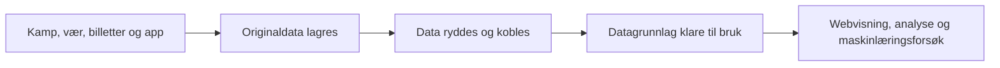

# Klubbdata
[](https://github.com/NilsenTommy/club-data-platform/actions/workflows/ci.yml)


**Klubbdata** er et porteføljeprosjekt som viser hvordan en fotballklubb kan
samle kampdata, vær, billettsalg og supporterdata i ett pålitelig grunnlag for
analyse. FK Bodø/Glimt brukes som eksempel.

Prosjektet følger hele veien fra kildene til en ferdig, interaktiv visning. Det
handler ikke bare om å flytte data, men om å gjøre dem forståelige, etterprøvbare
og trygge å bruke.

[Åpne den publiserte porteføljevisningen](https://nilsentommy.github.io/club-data-platform/)

> [!IMPORTANT]
> Dette er en teknisk demonstrasjon, ikke en produksjonsløsning eller en
> offisiell løsning for FK Bodø/Glimt. Kamp-, stadion- og værdata er ekte.
> Billett- og supporterdata er laget for demonstrasjon og tilhører ikke ekte
> personer.

## Hvorfor prosjektet er relevant

En klubb har ofte nyttig informasjon fordelt på flere systemer. Kampene ligger
ett sted, billettkjøp et annet og samtykker et tredje. Da blir selv enkle
spørsmål tidkrevende å svare på, og ulike team kan ende med forskjellige svar.

Prosjektet viser hvordan et felles datagrunnlag kan:

- samle informasjon fra flere kilder uten å miste originaldataene
- gi samme definisjon av en kamp, et stadion og en supporter på tvers av systemer
- gjøre kvalitet og mangler synlige i stedet for å fylle inn usikre svar
- skille mellom hvem som er aktiv, og hvem klubben faktisk har lov til å kontakte
- gjøre analyser og maskinlæring sporbare og mulige å etterprøve

## Hva løsningen kan svare på

| Spørsmål | Hvordan prosjektet håndterer det |
|---|---|
| Hva skjedde rundt en kamp? | Resultat, stadion, vær og solgte billetter samles i én kampoversikt. |
| Hvilke supportergrupper er mest aktive? | Kjøpsaktivitet oppsummeres i tydelige grupper uten å publisere persondata. |
| Hvem kan klubben kontakte? | En supporter må både ha sagt ja til markedsføring og ha en kontaktbar e-postadresse. |
| Kan vi stole på tallene? | Faste regler, datakvalitetskontroller og tester gjør samme kjøring reproduserbar. |
| Gir maskinlæring nok merverdi? | Flere inndelinger sammenlignes, og forsøket tas ikke i bruk når gevinsten ikke er godt nok dokumentert. |

Demoen inneholder blant annet **21 kamper**, **540 syntetiske supportere** og
**278 supportere som kan kontaktes**. Vær finnes bare for 8 av 21 kamper. De
resterende står uten måling i stedet for å få et gjettet tall.

## Fra rådata til ferdige svar



I koden kalles stegene **Bronze**, **Silver** og **Gold**:

- **Bronze** er originalen fra kilden, lagret uendret.
- **Silver** er den ryddede og sammenkoblede arbeidsversjonen.
- **Gold** er ferdige datagrunnlag laget for et konkret behov.

## Datagrunnlag klare til bruk

| Datagrunnlag | Innhold | Viktig avgrensning |
|---|---|---|
| Kampinnsikt (`match_insights.parquet`) | Resultat, stadion og vær per kamp | Manglende vær forblir manglende. |
| Billettsalg (`match_ticket_sales.parquet`) | Antall billetter og brutto salg per kamp | Viser kjøp, ikke faktisk oppmøte. |
| Supporteraktivering (`fan_activation.parquet`) | Aktivitet og samtykkestatus per supporter | Inneholder kun syntetiske persondata. |
| Supportergrupper (`fan_segment_summary.parquet`) | Aggregerte tall per aktivitetsgruppe | Inneholder ikke persondata og kan publiseres. |

## Teknisk gjennomføring

Den komplette løsningen kan kjøres lokalt med Python, pandas og Parquet. I
tillegg er kampdelen bygget som en skyløsning for å vise hvordan de samme
prinsippene kan brukes i en større dataplattform.

| Del | Teknologi |
|---|---|
| Lokal datapipeline | Python 3.9+, pandas, pyarrow og Parquet |
| Skyløsning | AWS S3, Databricks, Spark, Delta Lake, Unity Catalog og Lakeflow Jobs |
| Modellering og kvalitet | dbt, eksplisitte valideringsregler og automatiserte tester |
| Maskinlæring | scikit-learn og MLflow i et isolert segmenteringseksperiment |
| Infrastruktur og levering | Terraform, Databricks Asset Bundles og GitHub Actions |
| Presentasjon | Statisk HTML, CSS og JavaScript uten backend eller persondata |

Den lokale løsningen dekker både kamp- og supporterdata. Skyløsningen
dekker foreløpig kampdata. Se [arkitekturdokumentasjonen](docs/architecture.md)
for dataflyt, tabeller og tekniske avveiinger.

## Viktige avgrensninger

- Dette er en prototype og mangler blant annet full produksjonstilgang,
	automatisk utrulling og overvåking.
- Supporter- og billettdata er syntetiske. Innsikten demonstrerer metode, ikke
	faktiske forhold i klubben.
- Solgte billetter brukes som mål på etterspørsel, ikke som publikumstall.
- Maskinlæringsforsøket er dokumentert, men ikke satt i produksjon eller brukt til
	automatiske beslutninger.

Se [governance](docs/governance.md) og
[begrensninger og vei videre](docs/limitations.md) for detaljer.

## Kom i gang

### Se webvisningen

Webvisningen trenger ingen bygging eller installasjon:

```bash
python3 -m http.server 4173 --directory docs
```

Åpne deretter [http://localhost:4173](http://localhost:4173). Visningen leser et
statisk, aggregert datauttrekk og gjør ingen kall til API-er, AWS eller
Databricks.

### Sett opp lokal kjøring

Kjør kommandoene fra roten av repoet:

```bash
python3 -m venv .venv
source .venv/bin/activate
python3 -m pip install -r requirements.txt
cp .env.example .env
```

For å hente nye kamp- og værdata fyller du inn følgende i `.env`:

```dotenv
FOOTBALLDATA_API_KEY=your_api_key_here
FROST_CLIENT_ID=your_client_id_here
PLATFORM_USER_AGENT=football-club-data-platform/0.1 your-real-email@example.org
```

[MET Norway Frost](https://frost.met.no/auth/requestCredentials.html) utsteder
`FROST_CLIENT_ID`. `PLATFORM_USER_AGENT` må inneholde en reell kontaktadresse
for å følge reglene til OpenStreetMap Nominatim. `.env` er ignorert av Git og
skal ikke legges inn i repoet.

### Kjør dataflyten

Repoet inneholder allerede et rådatauttrekk. Bygg ferdige data på nytt med:

```bash
python3 -m src.build_silver
python3 -m src.build_gold
python3 -m src.build_fan_silver
python3 -m src.build_ticket_gold
python3 -m src.build_fan_gold --as-of 2026-08-22
python3 -m src.build_ml_features
python3 -m src.export_portfolio_data
```

For å hente ferske kildedata eller lage supportergrunnlaget på nytt, kjør disse
før byggestegene:

```bash
python3 -m src.fetch_matches
python3 -m src.geocode_venues
python3 -m src.fetch_weather
python3 -m src.generate_fan_data
```

De tre første kommandoene krever API-tilgangen fra `.env`. Supportergeneratoren
er lokal og lager de samme syntetiske dataene ved hver kjøring.

## Tester

Kjør hele testsuiten uten live API-kall:

```bash
python3 -m unittest discover -s tests -v
python3 -m src.export_portfolio_data --check
```

Testene dekker innhenting, kobling, forretningsregler, samtykke, datakvalitet og
reproduserbare resultater. GitHub Actions kjører kontrollene på Python 3.9 og
3.12, i tillegg til validering av frontend, dbt og Terraform.

## Finn frem i prosjektet

| Mappe | Innhold |
|---|---|
| `src/` | Innhenting, bearbeiding, datakvalitet og eksport |
| `data/` | Rådata, ryddede data og ferdige datagrunnlag |
| `docs/` | Webvisning og teknisk dokumentasjon |
| `databricks/` | Notebooks og definisjon av Databricks-jobben |
| `dbt/` | Gold-modell og datatester for skyløsningen |
| `infra/terraform/` | Infrastrukturkode for S3 |
| `tests/` | Automatiserte tester for den lokale dataflyten |

## Fordypning

- [Arkitektur](docs/architecture.md): dataflyt, datasett og tekniske avveiinger
- [Governance](docs/governance.md): eierskap, personvern og samtykke
- [Begrensninger](docs/limitations.md): hva demoen ikke dekker og prioritert vei
  mot produksjon
- [ML- og AI-strategi](docs/ml-ai-strategy.md): metode, resultater og hvorfor
	modellen ikke er produksjonssatt
- [Databricks bundle](databricks/bundle/README.md): validering og manuell utrulling

## Datakilder og bruk

- Kampdata kommer fra [FootballData](https://footballdata.io/).
- Stadionplasseringer kommer fra
	[OpenStreetMap contributors](https://www.openstreetmap.org/copyright) via
	Nominatim og følger ODbL og tjenestens bruksvilkår.
- Historiske værdata og stasjonsinformasjon kommer fra
	[MET Norway Frost](https://frost.met.no/) og følger lisensen oppgitt i
	API-responsene.
- Billett- og supporterdata er syntetiske og laget lokalt i prosjektet.

Koden er lisensiert under [MIT-lisensen](LICENSE). Eksterne rådata følger
vilkårene og lisensene til de respektive kildene.
