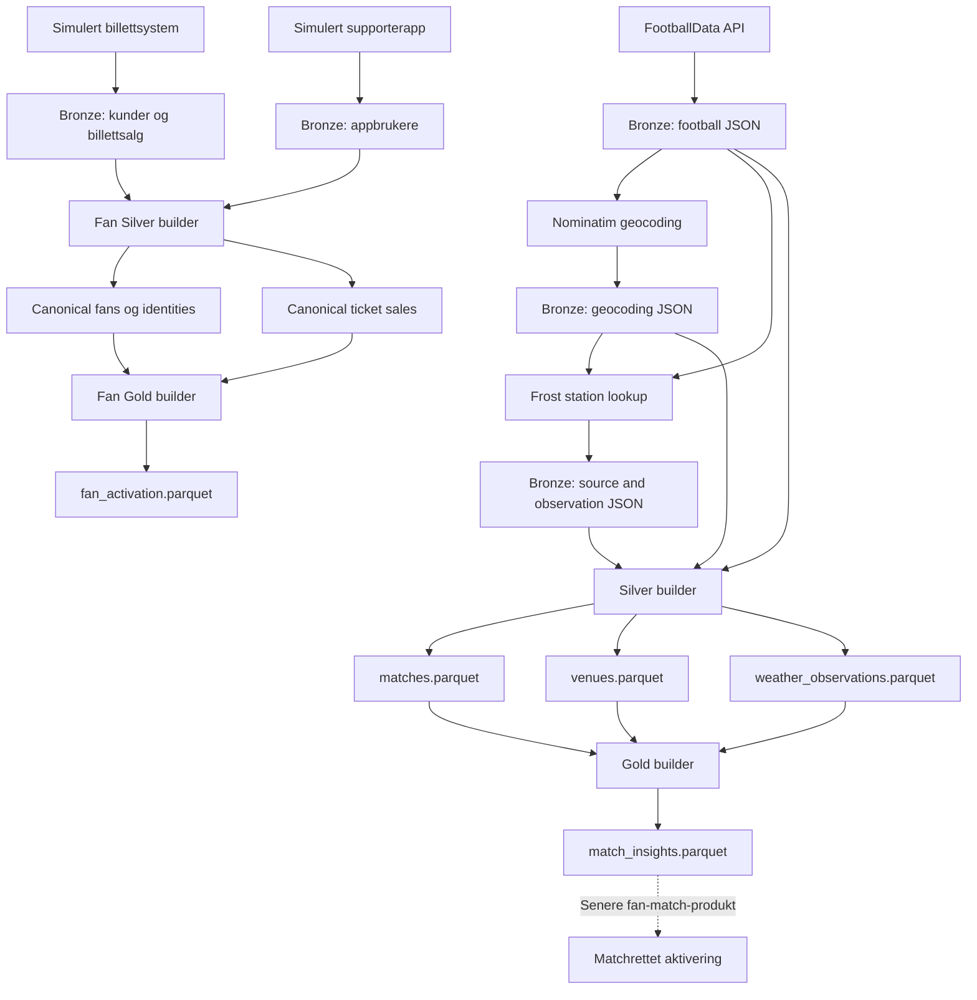
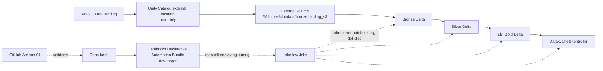

# Football Club Data Platform

[](https://github.com/NilsenTommy/club-data-platform/actions/workflows/ci.yml)


En liten, komplett referanseimplementasjon av et **klubbeid datafundament**:
reelle kampdata, stadiondata og historiske værobservasjoner kombinert med en
helsyntetisk supporterpopulasjon, foredlet gjennom **Bronze → Silver → Gold** til
to analyseklare dataprodukter. Den opprinnelige lokale pandas/Parquet-versjonen
er beholdt, og kampdomenet er i tillegg utvidet til AWS S3 og Databricks.

> [!IMPORTANT]
> Dette er en teknisk demonstrasjon og et læringsprosjekt, ikke en
> produksjonsklar plattform. All supporterdata er syntetisk og tilhører ikke
> ekte personer.

| | |
|---|---|
| **Domene** | Fotballklubb, med FK Bodø/Glimt som eksempel |
| **Stack** | Python 3.9+, pandas, Parquet, AWS S3, Terraform, Databricks, Databricks Asset Bundles / Databricks Declarative Automation Bundles, Apache Spark, Delta Lake, Unity Catalog, Lakeflow Jobs, dbt, GitHub Actions |
| **Omfang** | 3 eksterne API-er · 8 pipeline-steg · 6 Silver-datasett · 2 Gold-dataprodukter · 98 tester |
| **Resultat** | 3 API-er · 34 S3-filer · 21 Gold-kamper · 540 syntetiske fans · 98 tester |
| **Kjennetegn** | Deterministisk output, kildeuavhengig modell, eksplisitt datakvalitet, consent-aware aktivering |
| **Dybdedokumentasjon** | [Arkitektur](docs/architecture.md) · [Governance](docs/governance.md) |

---

## 1. Problem

> Fotballklubber produserer data på tvers av spesialiserte systemer for sport,
> billettering, kommersiell drift og digitale flater. Utfordringen er å etablere
> et pålitelig datafundament uten å binde organisasjonen til enkeltstående
> kildesystemer eller aktiveringsplattformer.

Konsekvensen når fundamentet mangler er gjenkjennelig: hvert nytt spørsmål
besvares ved å koble sammen kildesystemer på nytt, «supporter» betyr én ting i
billettsystemet og noe annet i appen, og aktiveringsverktøyet ender opp med å eie
definisjonen av hvem klubben faktisk har lov til å kontakte.

## 2. Mål

> Bygge en liten referanseimplementasjon av et klubbeid datafundament.

Konkret skal prosjektet vise:

- **Rådata bevares uendret**, så intern modell kan endres uten ny innhenting.
- **Én kildeuavhengig modell** med plattformens egne nøkler for kamp, stadion og fan.
- **Dataprodukter med tydelig grain**, klare til bruk uten kjennskap til kildene.
- **Determinisme**, så en endring i tall alltid kan spores til en endring i data
  eller logikk — aldri til tilfeldigheter i kjøringen.
- **Samtykke som en førsteklasses egenskap**, ikke et filter noen må huske å legge på.

Målet er *ikke* å demonstrere flest mulig verktøy. Hvert valg skal kunne
forsvares med problemet det løser.

## 3. Arkitektur

Prosjektet har to implementasjonsspor. Den lokale referanseimplementasjonen kan
kjøres ende-til-ende fra repoet og bruker filer, pandas og Parquet. Cloud-
utvidelsen behandler de samme rå kamp-, stadion- og værdataene med S3 som
landing zone og Databricks som lakehouse. Supporterdata er med vilje bare i den
lokale implementasjonen og er ikke flyttet til S3.

### Lokal referanseimplementasjon



| Lag | Ansvar | Eier | Format |
|---|---|---|---|
| **Bronze** | Kilderesponser lagret byte-for-byte, immutable og cachet | Kildesystemet | JSON / CSV |
| **Silver** | Canonical, kildeuavhengig modell med typing, deduplisering og validering | Plattformen | Parquet |
| **Gold** | Dataprodukter med ett definert grain og én definert bruker | Forretningsdomenet | Parquet |

Gold leser bare Silver. Silver leser bare Bronze. Ingen steg hopper over et lag,
og ingen steg skriver tilbake til en kilde.

### Cloud-utvidelse



Den private S3-bøtten `clubdata-platform-landing-portfolio` inneholder 34
råfiler: 1 fra FootballData, 11 fra Nominatim, 14 Frost source-responser og 8
Frost observation-responser. Block Public Access, Bucket Owner Enforced,
SSE-S3 og versjonering er aktivert. Lifecycle-reglene sletter gamle
ikke-gjeldende versjoner etter 30 dager, beholder to nyere ikke-gjeldende
versjoner og avbryter ufullstendige multipart-opplastinger etter 7 dager.
Selve bøtten og sikkerhetskonfigurasjonen administreres nå med Terraform. Den
eksisterende bøtten ble importert, ikke gjenskapt; etter apply viste en ny plan
`0 add, 0 change, 0 destroy`. Lokal state er ignorert og ikke committet.

Databricks eksponerer bøtten gjennom den read-only external location-en
`clubdata_landing_s3` og Unity Catalog-volumet
`/Volumes/clubdata/bronze/landing_s3`. Notebookene bygger Bronze og Silver som
Delta-tabeller, mens Gold-tabellen `match_insights` bygges med dbt. Lakeflow
Jobs orkestrerer notebook- og dbt-stegene. Jobbdefinisjonen for development
ligger som en Databricks Declarative Automation Bundle i `databricks/bundle/`
med lokale `WORKSPACE`-kilder for notebooks og dbt. En separat dev-jobb er
deployet manuelt, og hele seks-task-kjeden er testkjørt med `SUCCESS`. Den
eksisterende hovedjobben ble verken bundet til eller endret av deployen.

Detaljert gjennomgang av hvert lag, alle åtte pipeline-steg, datasett-skjemaene
og begrunnelsen bak hver avveiing ligger i
[docs/architecture.md](docs/architecture.md).

## 4. Dataprodukter

### Match Insights — `data/gold/match_insights.parquet`

Én rad per kamp med kampfakta, resultat sett fra klubben, stadionmetadata og
været ved avspark.

| | |
|---|---|
| **Grain** | Én kamp |
| **Bruk** | Kampanalyse, dashboards, kontekst for etterspørselsmodeller |
| **Persondata** | Ingen |
| **Dagens uttrekk** | 21 kamper, 14 med koordinater, 8 med vær ved avspark |

Produktet svarer på spørsmål som *«spiller vi dårligere i regn på bortebane?»*
uten at konsumenten trenger å kjenne FootballData, Nominatim eller Frost.

**Sentral avveiing:** Vær er ikke en enkel join. Én kamp kan ha mange
observasjoner fra flere tidsserier. Valget er derfor helt deterministisk — samme
`venue_id`, maks tre timer fra avspark, korteste tidsavstand, deretter før
avspark, deretter stasjonsavstand og stasjons-ID. Finnes ingen stasjon innenfor
50 km, står feltene tomme i stedet for å fylles med en måling fra feil sted.

### Fan Activation — `data/gold/fan_activation.parquet`

Én rad per canonical fan med 12 måneders kjøpsatferd, engagement-segment,
samtykkestatus og aktiveringsstatus.

| | |
|---|---|
| **Grain** | Én canonical fan |
| **Bruk** | Målgruppegrunnlag for billettaktivering og reaktivering |
| **Persondata** | Ja — e-post og visningsnavn (syntetisk) |
| **Dagens uttrekk** | 540 fans, 278 aktiveringsbare · 115 `INACTIVE`, 13 `OCCASIONAL`, 206 `ENGAGED`, 206 `HIGHLY_ENGAGED` |

Snapshotdatoen er en påkrevd `--as-of`-parameter, ikke `now()`. Det gjør
12-månedersvinduet reproduserbart og testbart.

**Sentral avveiing:** de to kildesystemene deler ingen nøkkel, og generatoren
skriver bevisst aldri sin interne person-ID til rådata. Identiteten må derfor
løses fra fragmenterte felter. Koblingen er konservativ — to identiteter slås
sammen bare når den normaliserte e-postadressen forekommer nøyaktig én gang i
hver kilde. Resultatet er 260 av 540 fans koblet på tvers av kilder, altså langt
fra alt. Det er poenget: en forklarbar regel som lar tvilstilfeller stå uløst er
mer verdt enn et imponerende tall ingen kan etterprøve.

**Ikke attendance.** `matches_purchased_12m` teller kjøp, ikke oppmøte.
Plattformen har ingen billettscan-kilde, og produktet later ikke som den har det.

## 5. Governance

```text
Kildesystemene eier de operasjonelle prosessene.
Domenene beholder forretningseierskapet.
Plattformen lager gjenbrukbare canonical data.
Persondata skilles fra analytisk bruk der det er mulig.
Aktivering krever gyldig samtykke.
```

I praksis:

- **Ticketing er autoritativ** for samtykke. Plattformen kopierer verdien, den
  definerer den ikke.
- **Samtykke har tre tilstander** — `True` (283), `False` (142) og *ukjent* (115).
  App-only fans får ukjent, ikke et implisitt avslag. `False` er en beslutning
  tatt av en person; ukjent er en mangel hos plattformen.
- **`marketing_allowed` krever både** eksplisitt samtykke og en kontaktbar
  e-post. Et segment beskriver atferd — samtykket avgjør handling.
- **`push_opt_in` er en kanalpreferanse**, ikke marketing consent.
- **Bygget avvises** hvis samtykket ble oppdatert etter valgt `--as-of`, slik at
  en målgruppeliste aldri bygger på en status som ikke fantes på
  snapshot-tidspunktet.
- **Kampdomenet er persondatafritt** og kan derfor deles bredere enn
  fan-produktene.

Eierskapsmodell, dataminimering, kjente gap og prioritert plan står i
[docs/governance.md](docs/governance.md).

## 6. Hva jeg bevisst ikke bygde

Den lokale implementasjonen er bevisst liten selv om cloud-utvidelsen viser
hvordan de samme prinsippene kan realiseres med en katalog, objektlagring,
Spark, Delta, dbt og orkestrering.

| Ikke bygget | Hvorfor ikke | Når det ville lønt seg |
|---|---|---|
| Automatisk CD | Bundle-deploy og kjøring av dev-jobben er manuell. GitHub Actions har ingen Databricks-credentials og deployer eller starter ikke Databricks-jobber | Når deploy og jobbstart kan automatiseres med tydelig miljø- og godkjenningsmodell |
| Komplett Infrastructure as Code | S3-bøtten og sikkerhetskonfigurasjonen er Terraform-styrt, og Lakeflow-jobbdefinisjonen er Bundle-styrt for dev. IAM, storage credential, external location, external volume, produksjonstarget/binding og automatisk bundle-deploy er ikke IaC/CD | Når de gjenværende ressursene kan forvaltes med miljøskille, sikker state og godkjent produksjonsprosess |
| Valideringsrammeverk | Eksplisitt Python viser *hva* som valideres og hvorfor, uten et rammeverk å lære først | Når reglene skal deles og håndheves på tvers av team |
| Inkrementell load | Full refresh er trivielt reproduserbart. Inkrementelt krever watermark, sen ankomst og korreksjoner | Når historikken gjør full refresh for dyr |
| Probabilistisk identitetsmatching | En konservativ regel er forklarbar og reviderbar; et sannsynlighetsscore uten fasit er det ikke | Med en manuell gjennomgangsflyt og faktisk verifisering |
| Prediktiv aktiveringsscore | Uten attendance- og app-events ville modellen lært av de samme kjøpene den allerede rapporterer | Når event-data faktisk finnes |
| Fan-match-produkt | Krysser to domener og reiser reelle spørsmål om tilgang og dataminimering som fortjener en beslutning, ikke en snarvei | Når både konsument og tilgangsmodell er definert |
| Produksjonsklar tilgangskontroll og retention per datasett | S3-landing har grunnsikring og lifecycle, men supporterproduktene er fortsatt lokale prototypefiler | Før behandling av data om ekte personer |

Full liste over prototypebegrensninger står i
[docs/architecture.md](docs/architecture.md#kjente-begrensninger), og
governance-gapene med prioritert rekkefølge i
[docs/governance.md](docs/governance.md#kjente-gap-og-plan).

---

## Datakilder

| | Kilde | Bruk | Tilgang |
|---|---|---|---|
|  | [FootballData](https://footballdata.io/) | Kamper for team ID `293` | Bearer-token |
|  | [OpenStreetMap Nominatim](https://nominatim.org/) | Geocoding av stadioner | Identifiserende User-Agent |
|  | [MET Norway Frost](https://frost.met.no/) | Værstasjoner og historiske observasjoner | Frost client ID |
| | Syntetisk billettsystem og supporterapp | Fragmenterte supporter- og billettdata | Lokal generator, ingen API-tilgang |

Locationforecast brukes ikke. Det leverer prognoser, mens prosjektet trenger
historiske observasjoner for ferdigspilte kamper.

## Teknologi

- **Lokal referanseimplementasjon:** Python 3.9+, `requests`, `python-dotenv`,
	pandas, pyarrow, Parquet, `unittest` og `unittest.mock`.
- **Cloud-utvidelse:** AWS S3, Databricks, Apache Spark, Delta Lake, Unity
	Catalog, Lakeflow Jobs, dbt og Databricks Declarative Automation Bundles.
- **CI:** GitHub Actions med Python 3.9 og 3.12, compile-kontroll, 98
	unit-tester, offline `dbt parse` og Terraform-validering.

## Kom i gang

### 1. Opprett miljø

```bash
python3 -m venv .venv
source .venv/bin/activate
python3 -m pip install -r requirements.txt
```

### 2. Konfigurer API-tilgang

```bash
cp .env.example .env
```

```dotenv
FOOTBALLDATA_API_KEY=your_api_key_here
FROST_CLIENT_ID=your_client_id_here
PLATFORM_USER_AGENT=football-club-data-platform/0.1 your-real-email@example.org
```

- `FOOTBALLDATA_API_KEY` brukes som Bearer-token.
- `FROST_CLIENT_ID` opprettes via
	[Frost credentials](https://frost.met.no/auth/requestCredentials.html).
- `PLATFORM_USER_AGENT` må identifisere applikasjonen med en reell kontaktadresse
	eller nettside for å følge Nominatim-policyen.

`.env` er ignorert av Git. Ikke legg API-nøkler eller personlige credentials i
repoet.

## Kjør pipeline

Kommandoene kjøres fra repo-roten og i denne rekkefølgen:

```bash
python3 -m src.fetch_matches
python3 -m src.geocode_venues
python3 -m src.fetch_weather
python3 -m src.build_silver
python3 -m src.build_gold
python3 -m src.generate_fan_data
python3 -m src.build_fan_silver
python3 -m src.build_fan_gold --as-of 2026-08-22
```

Hva hvert steg gjør, hvilke avveiinger som ligger bak og hvilke tall det
produserer på datasettet i repoet, er dokumentert i
[docs/architecture.md](docs/architecture.md#pipelinesteg).

## Datasett og datakvalitet

Skjema, nøkkelstrategi og de deterministiske reglene for hvert Silver- og
Gold-datasett er dokumentert i
[docs/architecture.md](docs/architecture.md#silver-datasett).

Kort oppsummert:

- Kritiske brudd stopper bygget med en typet exception og tydelig melding.
- Gold valideres mot Silver: samme kamper, samme fans, ingen dupliserte joins.
- Beregnede felter valideres mot sine egne regler, så `engagement_segment` og
  `marketing_allowed` ikke kan komme ut av synk med definisjonen.
- Uendrede Bronze-filer gir byte-identiske Silver-filer, og uendret Silver gir
  byte-identisk Gold.

## Inspiser resultatene

```python
import pandas as pd

print(pd.read_parquet("data/silver/matches.parquet").head())
print(pd.read_parquet("data/silver/venues.parquet").head())
print(pd.read_parquet("data/silver/weather_observations.parquet").head())
print(pd.read_parquet("data/silver/silver_fans.parquet").head())
print(pd.read_parquet("data/silver/silver_fan_identities.parquet").head())
print(pd.read_parquet("data/silver/silver_ticket_sales.parquet").head())
print(pd.read_parquet("data/gold/match_insights.parquet").head())
print(pd.read_parquet("data/gold/fan_activation.parquet").head())
```

## Statisk webapp

En minimal visualisering av kampdata, vær og supportersegmenter ligger i
[`docs/index.html`](docs/index.html). Siden har ingen backend eller eksterne
JavaScript-avhengigheter og kan forhåndsvises lokalt med:

```bash
python3 -m http.server 4173 --directory docs
```

Åpne deretter `http://localhost:4173`. For publisering i GitHub Pages, velg
**Deploy from a branch**, branchen `main` og mappen `/docs` under
**Settings > Pages**. Datagrunnlaget er et statisk, aggregert uttrekk i
`docs/data/visualizations.json` uten persondata. Solgte billetter er tydelig
merket som proxy fordi faktisk attendance mangler.

## Tester

Kjør hele testsuiten uten live API-kall:

```bash
python3 -m unittest discover -s tests -v
```

98 tester bruker mocks og midlertidige mapper. De dekker HTTP-feil, credentials,
caching, rå byte-lagring, deduplisering, canonical venue-ID-er, weather-serie-
valg, valg av vær ved kampstart, resultatlogikk, supporterfragmentering,
canonical fan-kobling, deterministiske CSV-/Parquet-filer, datatyper,
fan-segmentering, consent-aware aktivering, validering og Parquet-skriving.

GitHub Actions kjører compile-kontroll og alle 98 testene på både Python 3.9 og
3.12. Separate jobber kjører offline `dbt parse` og Terraform-formatkontroll,
`init -backend=false` og `validate` uten AWS-credentials. Automatisk
Terraform-plan og apply er ikke implementert. Bundlen er validert og den
separate dev-jobben er testkjørt lokalt med autentisert Databricks CLI. GitHub
Actions har ingen Databricks-credentials, deployer ikke bundlen og starter ikke
Databricks-jobber. Deploy og kjøring er derfor fortsatt manuell, og dette er CI,
ikke full CD.

Nyttige tilleggskontroller:

```bash
python3 -m py_compile src/*.py tests/*.py
git diff --check
```

## Prosjektstruktur

```text
.
├── data/
│   ├── bronze/
│   ├── silver/
│   └── gold/
├── docs/
│   ├── data/
│   │   └── visualizations.json
│   ├── index.html
│   ├── app.js
│   ├── styles.css
│   ├── architecture.md
│   └── governance.md
├── databricks/
│   ├── notebooks/
│   └── bundle/
│       ├── databricks.yml
│       ├── README.md
│       └── resources/
│           └── clubdata_job.yml
├── dbt/
│   ├── models/
│   └── tests/
├── infra/
│   └── terraform/
│       └── aws-s3/
├── .github/
│   └── workflows/
├── src/
│   ├── fetch_matches.py
│   ├── geocode_venues.py
│   ├── fetch_weather.py
│   ├── build_silver.py
│   ├── build_gold.py
│   ├── generate_fan_data.py
│   ├── build_fan_silver.py
│   └── build_fan_gold.py
├── tests/
├── .env.example
├── requirements.txt
└── README.md
```

## Attribution og bruksvilkår

- Geocodingdata kommer fra
  [OpenStreetMap contributors](https://www.openstreetmap.org/copyright) via
  Nominatim og er underlagt ODbL og tjenestens usage policy.
- Historiske værdata og station metadata kommer fra
  [MET Norway Frost](https://frost.met.no/) og er underlagt MET Norways vilkår
  og angitt datalisens i API-responsene.
- Kampdata er underlagt vilkårene til FootballData-leverandøren.
- All supporterdata er syntetisk, se
  [docs/governance.md](docs/governance.md#syntetiske-data).

Koden er lisensiert under [MIT-lisensen](LICENSE). Lisensen omfatter ikke
eksterne rådata; disse følger vilkårene, lisensene og attribution-kravene til
de respektive kildene som angitt over.
