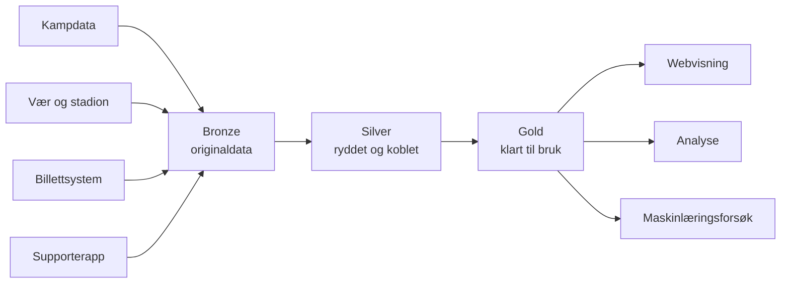
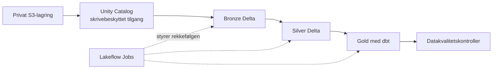

# Arkitektur

Dette dokumentet forklarer hvordan [Klubbdata](../README.md) går fra spredte
kilder til ferdige datagrunnlag. Målet er å vise strukturen og de viktigste
valgene uten å gjenta all logikken som allerede finnes i kode og tester.

> [!IMPORTANT]
> Løsningen er en prototype. Den lokale dataflyten er komplett, mens
> skyløsningen foreløpig demonstrerer kampdelen. Se
> [begrensninger og vei videre](limitations.md) for skillet mellom demo og
> produksjon.

## Helhetsbildet

Dataene går gjennom tre lag. Hvert lag har ett tydelig ansvar:

| Lag | Folkelig forklart | Teknisk ansvar |
|---|---|---|
| **Bronze** | Originalen | API-responser og kildefiler lagres uendret som JSON eller CSV. |
| **Silver** | Arbeidsversjonen | Data får riktige typer, duplikater fjernes og kilder kobles med felles ID-er. |
| **Gold** | Det ferdige datagrunnlaget | Data samles rundt et konkret spørsmål, for eksempel én rad per kamp. |

Silver leser bare Bronze, og Gold leser bare Silver. Dermed kan et ferdig tall
spores tilbake til den ryddede modellen og videre til originalkilden.

## To måter å kjøre løsningen på

| | Lokal løsning | Skyløsning |
|---|---|---|
| **Formål** | Komplett og lett å kjøre fra repoet | Vise hvordan kampdelen kan driftes på en større plattform |
| **Omfang** | Kamp, vær, billetter og supportere | Kamp, stadion og vær |
| **Lagring** | JSON, CSV og Parquet | AWS S3 og Delta Lake |
| **Behandling** | Python og pandas | Databricks, Spark og dbt |
| **Orkestrering** | Kommandoer kjøres i rekkefølge | Lakeflow Jobs |

Den lokale løsningen er referansen for hele prosjektet. Skyløsningen bruker de
samme prinsippene, men supporterdata er med vilje ikke flyttet dit. Bare et
minimert, syntetisk grunnlag uten navn, e-post og samtykke brukes i det isolerte
maskinlæringsforsøket.

## Den lokale datareisen

| Steg | Hva som skjer | Viktigste kode |
|---|---|---|
| 1. Hent kampdata | Kampresponsen lagres som mottatt | `fetch_matches.py` |
| 2. Finn stadion og vær | Stadioner geokodes, og historiske målinger hentes fra nærmeste egnede værstasjon | `geocode_venues.py`, `fetch_weather.py` |
| 3. Rydd kampdata | Kamper, stadioner og vær får en felles og kontrollert struktur | `build_silver.py` |
| 4. Lag kampinnsikt | Resultat, stadion og vær samles til én rad per kamp | `build_gold.py` |
| 5. Lag supporterdata | To simulerte systemer lager fragmenterte billett- og appidentiteter | `generate_fan_data.py` |
| 6. Koble supportere | Sikre identitetstreff samles, mens tvilstilfeller forblir separate | `build_fan_silver.py` |
| 7. Lag ferdige produkter | Billettsalg, aktivitet og samtykke oppsummeres | `build_ticket_gold.py`, `build_fan_gold.py` |
| 8. Publiser trygge tall | Aggregerte data uten personopplysninger eksporteres til webvisningen | `build_ml_features.py`, `export_portfolio_data.py` |

Kommandoene for å kjøre stegene finnes i [README-en](../README.md#kjør-dataflyten).

## Regler som betyr mest

Noen koblinger kan ikke løses med en enkel join. Prototypen bruker derfor
forsiktige og etterprøvbare regler:

- **Vær:** En målestasjon må ligge innen 50 km fra stadion. Målingen som brukes,
  må ligge innen tre timer fra avspark. Hvis ingen måling passer, står været
  tomt.
- **Stadion:** Geokoding gir en stabil `venue_id`, slik at videre kobling ikke
  avhenger av ulike skrivemåter av stadionnavnet.
- **Supporteridentitet:** Billett- og appidentiteter kobles bare når en
  normalisert e-postadresse er unik i begge kilder. Resten beholdes som separate
  supportere.
- **Samtykke:** Billettsystemet er kilden til markedsføringssamtykke. Manglende
  informasjon betyr «ukjent», ikke «nei».
- **Tidspunkt:** Supporterproduktet krever en eksplisitt `--as-of`-dato. Dermed
  bygger alle aktivitetsmål på samme, etterprøvbare tidsvindu.

Disse reglene prioriterer et forklarbart manglende svar fremfor et komplett,
men usikkert resultat.

## Datasett

Kolonnen «Én rad betyr» beskriver detaljnivået i hvert datasett.

### Silver

| Datasett | Én rad betyr | Bruk |
|---|---|---|
| `matches.parquet` | Én kamp | Felles kampinformasjon og kobling til stadion |
| `venues.parquet` | Ett stadion | Navn, sted og koordinater |
| `weather_observations.parquet` | Én værmåling | Historiske målinger knyttet til stadion og stasjon |
| `silver_fans.parquet` | Én samlet supporter | Felles supporter-ID, kontaktbarhet og samtykkestatus |
| `silver_fan_identities.parquet` | Én kildeidentitet | Kobling tilbake til billettsystem eller app |
| `silver_ticket_sales.parquet` | Én billetttransaksjon | Kjøp knyttet til supporter og kamp |

### Gold

| Datasett | Én rad betyr | Persondata |
|---|---|---|
| `match_insights.parquet` | Én kamp med resultat, stadion og vær | Nei |
| `match_ticket_sales.parquet` | Én kamp med fullførte billettkjøp | Nei |
| `fan_activation.parquet` | Én supporter med aktivitet og kontaktstatus | Ja, men kun syntetisk |
| `fan_segment_summary.parquet` | Én aktivitetsgruppe med aggregerte tall | Nei |

`docs/data/portfolio.json` er et publiseringsformat, ikke et nytt datalag.
Eksporten leser bare persondatafrie og aggregerte resultater, og stopper hvis
forbudte felt eller e-postadresser dukker opp.

## Skyløsningen

- Rå kamp-, stadion- og værfiler ligger i en privat, versjonert S3-bøtte.
- Databricks har skrivebeskyttet tilgang til originaldataene gjennom Unity
  Catalog. Behandlingen kan derfor ikke overskrive kilden.
- Spark-notebooks bygger Bronze og Silver som Delta-tabeller. dbt bygger Gold.
- Lakeflow Jobs styrer rekkefølgen. En egen utviklingsjobb er definert med en
  Databricks Asset Bundle og er testkjørt ende til ende.
- Terraform forvalter S3-bøtten og sikkerhetsinnstillingene. Resten av
  infrastrukturen er foreløpig bare delvis kodebasert.
- GitHub Actions tester kode, dataeksport, frontend, dbt og Terraform. Utrulling og
  oppstart av Databricks-jobben er fortsatt manuell.

Dette demonstrerer skillet mellom kontinuerlig kontroll av kode (**CI**) og
automatisk utrulling (**CD**) uten å hevde at begge er ferdige.

## Determinisme og datakvalitet

Samme inngangsdata skal gi samme resultat. Det gjør det mulig å forklare om et
tall endret seg fordi dataene eller reglene faktisk ble endret.

Løsningen håndhever blant annet at:

- kritiske feil stopper bygget med en tydelig melding
- ID-er er unike, og koblinger ikke lager ekstra kamper eller supportere
- Gold inneholder de samme kampene og supporterne som Silver
- beregnede resultater, segmenter og samtykkeregler følger definisjonen
- manglende stadion eller vær beholdes som manglende, uten å fjerne kampen
- uendret input gir identisk Parquet-output i samme miljø

159 tester dekker innhenting, kobling, forretningsregler, samtykke,
datakvalitet og reproduserbarhet uten live API-kall.

## Viktige tekniske valg

| Valg | Hvorfor |
|---|---|
| Beholde originaldata uendret | Nye regler kan testes uten å hente kildene på nytt eller miste historikken. |
| Lokal løsning ved siden av skyløsningen | Hele datareisen kan forstås og kjøres uten tilgang til AWS eller Databricks. |
| Full nybygging av Silver og Gold | Det er enkelt og reproduserbart for dagens datamengde. |
| Eksplisitte regler fremfor gjetting | Usikker geokoding, identitet og samtykke skal være synlig. |
| Python-validering og tester | Reglene er lette å finne og krever ikke et ekstra rammeverk i denne prototypen. |
| Aggregere før publisering | Webvisningen kan vise verdi uten å eksponere supporteropplysninger. |

## Kjente begrensninger

Produksjonsgap innen tilgangskontroll, sletting, samtykkehistorikk,
identitetskobling, infrastruktur som kode, automatisk utrulling og maskinlæring er
samlet i [begrensninger og vei videre](limitations.md).

Se også [governance](governance.md) for ansvar, persondata og samtykke, og
[ML- og AI-strategien](ml-ai-strategy.md) for eksperimentet og beslutningen om
ikke å produksjonssette modellen.